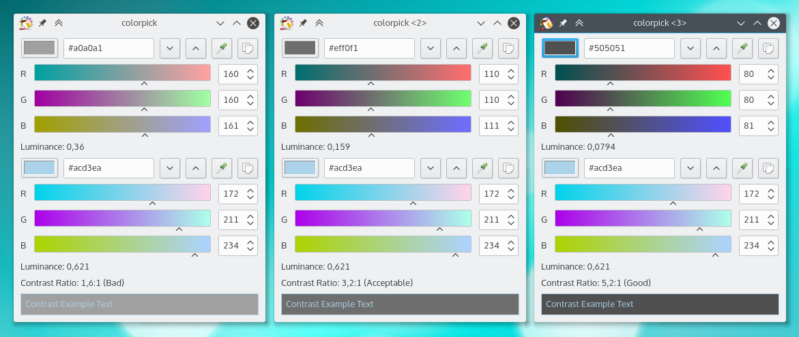

# ⚠  Colorpick now lives at [qtilities/colorpick](https://github.com/qtilities/colorpick)!

Thanks to redtide for taking it over.

---

# Colorpick: Color picker and contrast checker

Colorpick is a color picker, which makes it easy to check text readability by
letting you pick a background and foreground color and computing the contrast
between them.

It lets you know if contrast is good enough according to
<http://www.w3.org/TR/WCAG20/#visual-audio-contrast>.

It also comes with a handy magnified-picker, which you can control with the
cursor keys, for precise picking.

Finally, it lets you adjust colors and copy them to the clipboard as different
formats.

Colorpick is managed using the [lightweight project management policy][1].

[1]: http://agateau.com/2014/lightweight-project-management

## Requirements

- CMake
- Qt 5
- KF5GuiAddons
- KF5WidgetsAddons

## Installation

Create a build directory and change to it:

    mkdir build
    cd build

Run CMake and build:

    cmake path/to/colorpick
    make

Install (must be run as root if installing to /usr or /usr/local):

    make install

## Author

Aurélien Gâteau

## License

BSD
